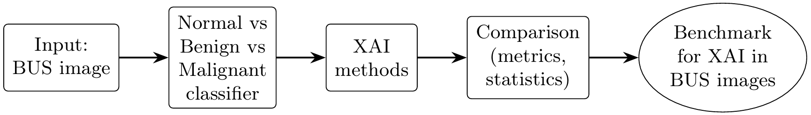
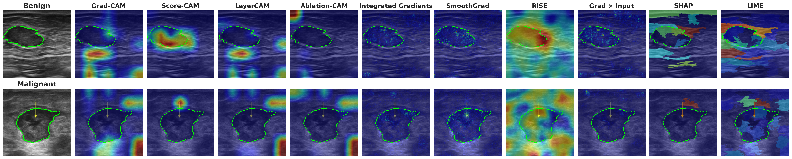
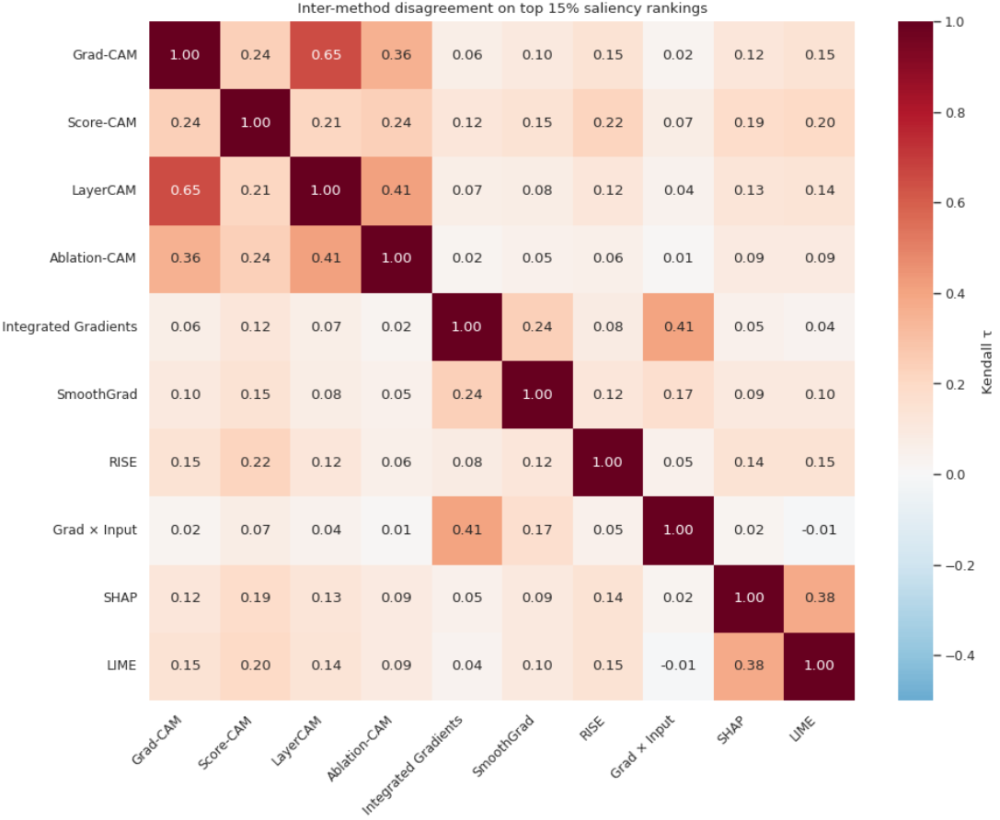
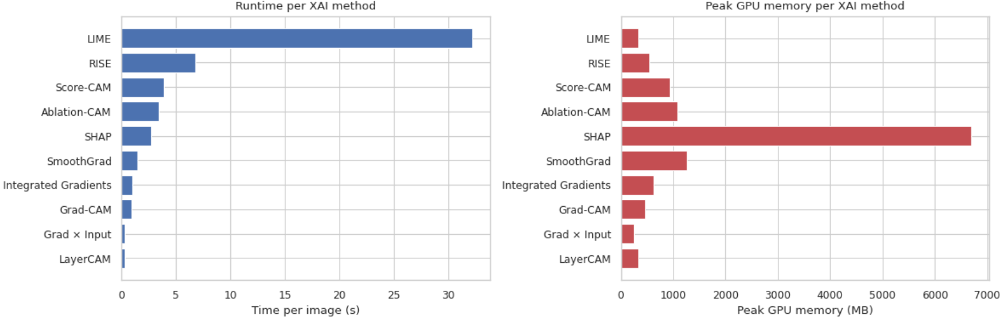

# Benchmarking Explainable AI for a MaxViT Breast Ultrasound Classifier

**A Multi-Method, Multi-Metric Study**

Ons Loukil, Amira Mouakher, Walid Barhoumi, Samira El Yacoubi

> Code accompanying the ACIVS 2026 paper. Deep learning matches radiologist-level
> accuracy on breast ultrasound (BUS), but clinical adoption is held back by the
> black-box nature of the models. This repository trains a **MaxViT-T** classifier
> on a unified BUS corpus (normal / benign / malignant) and benchmarks **ten XAI
> methods** along three axes (*faithfulness*, *localisation*, and *plausibility*)
> using seven metrics, a Friedman test, and a Kendall-τ disagreement analysis.



<!-- Optional badges, fill in once the repo is public:


-->

---

## Table of Contents

1. [Key Result](#key-result)
2. [Repository Structure](#repository-structure)
3. [Installation](#installation)
4. [Datasets](#datasets)
5. [Usage](#usage)
6. [Classifier: MaxViT-T Hyperparameters](#classifier-maxvit-t-hyperparameters)
7. [Data Augmentation](#data-augmentation)
8. [XAI Methods and Their Parameters](#xai-methods-and-their-parameters)
9. [Evaluation Metrics](#evaluation-metrics)
10. [Computational Cost](#computational-cost)
11. [Outputs Produced](#outputs-produced)
12. [Reproducibility Notes](#reproducibility-notes)
13. [Citation](#citation)
14. [License](#license)
15. [Acknowledgements](#acknowledgements)

---

## Key Result

No single explainer wins on every axis. The benchmark gives **metric-driven guidance**
for choosing an explainer in a clinical BUS pipeline:

| Axis | Leading method(s) | Metrics |
|---|---|---|
| **Faithfulness** | LIME, SHAP | Deletion AUC ↓, Insertion AUC ↑ |
| **Localisation** | Integrated Gradients, SmoothGrad (Score-CAM competitive) | Dice ↑, EBPG ↑ |
| **Plausibility** | LIME, Score-CAM (Avg Drop); Grad-CAM (Avg Increase) | Avg Drop ↓, Avg Increase ↑ |
| **Computational cost** | LayerCAM, Grad×Input, Grad-CAM (fastest & lightest) | Time, GPU memory, forward passes |

disagreement problem on BUS data, and the cost analysis below adds a practical
dimension: the two faithfulness leaders (LIME, SHAP) are also the most expensive, so the
right explainer depends on both the clinical goal *and* the available compute budget.



**Classifier test performance** (unified BUS corpus, 415 test images):

| Class | Precision | Recall | F1 | Support |
|---|---|---|---|---|
| Benign | 0.86 | 0.71 | 0.78 | 176 |
| Malignant | 0.73 | 0.82 | 0.77 | 138 |
| Normal | 0.84 | 0.96 | 0.90 | 101 |
| **Accuracy** | | | **0.807** | 415 |
| Macro avg | 0.81 | 0.83 | 0.82 | 415 |

---

## Repository Structure

```
.
├── README.md
├── requirements.txt
├── LICENSE
├── CITATION.cff
├── .gitignore
│
├── notebooks/
│   ├── 01_maxvit_train.ipynb          # MaxViT-T training (3-class)
│   └── 02_xai_benchmark.ipynb         # 10 XAI methods + 7 metrics + stats + cost
│
├── data/
│   └── README.md                      # how to obtain & build the unified corpus
│       # expected layout after building:
│       # data/unified_ultrasound_dataset/{train,val,test}/{benign,malignant,normal}/
│       # data/masks/{benign,malignant}/
│
├── outputs/                           # training curves, confusion matrix, results.json
│
└── assets/                            # figures used in the README / paper
    ├── pipeline.png
    ├── qualitative_final.png
    ├── disagreement_tau.png
    └── xai_cost_per_image.png
```

---

## Installation

```bash
# Python 3.10+ recommended (developed on 3.12)
python -m venv .venv
source .venv/bin/activate          # Windows: .venv\Scripts\activate

pip install --upgrade pip
pip install -r requirements.txt
```

A CUDA-capable GPU is strongly recommended. The notebooks were developed on a single
NVIDIA Tesla T4 (16 GB). The XAI benchmark is written to stream one image at a time and
keeps GPU memory roughly constant (~1–2 GB), so it also runs on modest GPUs.

---

## Datasets

The unified corpus harmonises three public BUS datasets to a single label set
(`normal`, `benign`, `malignant`):

| Dataset | Images | Masks | Reference |
|---|---|---|---|
| BUSI | yes | yes | Al-Dhabyani et al., *Data Brief* 28:104863 (2020) |
| BUS-UCLM | yes | yes | Vallez et al., *Sci. Data* 12(1):242 (2025) |
| BUS-UC | yes | yes | Iqbal & Sharif, *Eng. Appl. Artif. Intell.* 127:107292 (2024) |

After harmonisation the corpus contains **552 normal, 969 benign, 753 malignant**
(2 274 images), split ~70/10/20, **stratified by class and disjoint at the patient
level** to prevent leakage:

| Split | Normal | Benign | Malignant | Total |
|---|---|---|---|---|
| Train | 400 | 702 | 546 | 1 648 |
| Val | 51 | 91 | 69 | 211 |
| Test | 101 | 176 | 138 | 415 |
| **Total** | **552** | **969** | **753** | **2 274** |

**Expected on-disk layout** (see `data/README.md` for the build script/instructions):

```
data/unified_ultrasound_dataset/
├── train/{benign,malignant,normal}/*.png
├── val/{benign,malignant,normal}/*.png
└── test/{benign,malignant,normal}/*.png

data/masks/
├── benign/      benign (1).png, benign (1)_1.png, ...   # multi-lesion masks merged by OR
└── malignant/   ...                                     # normal images have no masks
```

> Please respect each source dataset's original license/terms. We redistribute only the
> code and the harmonisation logic, not the images.

---

## Usage

### 1) Train the classifier

```bash
jupyter lab notebooks/01_maxvit_train.ipynb
```

This produces the trained checkpoint, training curves, a confusion matrix, and
`results.json`.

> **Pretrained weights are not distributed.** The trained `.pth` checkpoint is not
> included in this repository, so the XAI benchmark cannot be run on its own. Run the
> training notebook first to produce a checkpoint, then set `MODEL_PATH` in the
> Configuration cell of `02_xai_benchmark.ipynb` to point at that file. The XAI notebook
> stops with a clear message if the checkpoint is missing.

### 2) Run the XAI benchmark

```bash
jupyter lab notebooks/02_xai_benchmark.ipynb
```

Set the paths in the **Configuration** cell, then run top to bottom. It evaluates all ten
methods on a stratified 60-image subset, writes per-class metric tables, runs the Friedman
test, draws critical-difference diagrams, computes the Kendall-τ matrix, renders the
qualitative figure, and (final section) profiles per-image runtime and memory.

> **Cost-only run:** the *Computational Cost & Timing* cell is self-contained. To run it
> without the full 60-image evaluation, execute the setup sections only: Setup,
> Configuration, Memory Helpers, Load MaxViT, Test Data + Mask Loader, and The 10 XAI
> Methods, then jump to the cost cell. You can skip the smoke test and everything from
> the streaming evaluation loop onward.

---

## Classifier: MaxViT-T Hyperparameters

All values are taken directly from the training configuration.

| Hyperparameter | Value |
|---|---|
| Backbone | MaxViT-T (`torchvision.models.maxvit_t`) |
| Pretrained weights | ImageNet (`MaxVit_T_Weights.DEFAULT`) |
| Classifier head | `Dropout(p=0.3)` → `Linear(in_features → 3)` |
| Number of classes | 3 (benign, malignant, normal) |
| Input resolution | 224 × 224 |
| Batch size | 16 |
| Epochs | 30 |
| Optimizer | AdamW |
| Initial learning rate (warm-up, head only) | 2e-4 |
| Learning rate after unfreeze | 2e-5 (= 2e-4 × 0.1) |
| Weight decay | 1e-4 |
| LR scheduler | CosineAnnealingLR, `eta_min = 1e-6` |
| Backbone freezing | Frozen epochs 1–4; **unfrozen from epoch 5** (full fine-tuning) |
| Loss | CrossEntropy with `label_smoothing = 0.1` |
| Class-imbalance handling | `WeightedRandomSampler` (inverse class frequency) |
| Mixed precision (AMP) | Enabled on CUDA (`torch.amp`) |
| Gradient clipping | max-norm 1.0 |
| Model selection | Best validation-accuracy checkpoint |
| Data workers | 4 |
| Normalisation | ImageNet mean `[0.485, 0.456, 0.406]`, std `[0.229, 0.224, 0.225]` |
| Random seed | 42 |

---

## Data Augmentation

Augmentation is applied to the **training split only**. The validation and test splits use
resize + normalise (no augmentation).

| Stage | Transform | Setting |
|---|---|---|
| Train | Resize | 256 × 256 |
| Train | RandomCrop | 224 × 224 |
| Train | RandomHorizontalFlip | p = 0.5 |
| Train | RandomVerticalFlip | p = 0.5 |
| Train | RandomRotation | ±15° |
| Train | ColorJitter | brightness 0.3, contrast 0.3, saturation 0.2 |
| Train | RandomAffine | translate ±5% (no rotation/scale/shear) |
| Train | Normalize | ImageNet mean/std |
| Val / Test | Resize → ToTensor → Normalize | 224 × 224, no augmentation |

---

## XAI Methods and Their Parameters

Ten methods from three families are evaluated, all targeting the **predicted** class.
Every saliency map is positively rectified (ReLU), min-max normalised, and upsampled to
224 × 224 before scoring.

**Shared evaluation configuration**

| Setting | Value |
|---|---|
| Evaluation subset | 60 stratified images (20 normal / 20 benign / 20 malignant) |
| Top-K saliency threshold | 15% |
| Deletion/Insertion steps | 20 |
| CAM target layer | last MaxViT stage (`model.blocks[-1].layers[-1]`) |
| Seed | 42 |

**Per-method parameters**

| Family | Method | Key parameters |
|---|---|---|
| Class-activation | **Grad-CAM** | last-stage target layer; gradient-pooled channel weights |
| Class-activation | **Score-CAM** | gradient-free; activation maps weighted by masked-input confidence |
| Class-activation | **LayerCAM** | last-stage target layer; element-wise positive gradient weighting |
| Class-activation | **Ablation-CAM** | last-stage target layer; channel importance by ablation |
| Pixel attribution | **Integrated Gradients** | `n_steps = 20`, zero baseline, `internal_batch_size = 2`, abs-max over channels |
| Pixel attribution | **SmoothGrad** | `NoiseTunnel(IntegratedGradients)`, `nt_type = "smoothgrad"`, `nt_samples = 4`, `stdevs = 0.15`, `n_steps = 15` |
| Pixel attribution | **Grad × Input** | single backward; `|input × grad|`, max over channels |
| Model-agnostic | **RISE** | `n_masks = 1000`, grid `s = 8`, `p1 = 0.5`, batch 16 |
| Model-agnostic | **SHAP** | KernelExplainer over SLIC superpixels; `n_segments = 50`, `compactness = 10`, `nsamples = 200`, Gaussian-blur baseline (`sigma = 8`) |
| Model-agnostic | **LIME** | `LimeImageExplainer`; `num_samples = 1000`, SLIC `n_segments = 50`, `compactness = 10`, `hide_color = 0` |

> **SmoothGrad note:** implemented as SmoothGrad-style noise applied to Integrated
> Gradients (via Captum `NoiseTunnel`), not to the raw input gradient (i.e. "SmoothGrad-IG").

---

## Evaluation Metrics

Seven metrics across three axes (arrows give the desired direction):

| Axis | Metric | Direction | Definition (as implemented) |
|---|---|---|---|
| Faithfulness | Deletion AUC | ↓ | Remove pixels most-salient-first (20 steps, replace with image mean); AUC of target confidence |
| Faithfulness | Insertion AUC | ↑ | Restore pixels most-salient-first onto a Gaussian-blurred baseline (`sigma = 10`); AUC of confidence |
| Faithfulness | ROAD | ↓ | Replace the top-p% most-salient pixels with noise at percentiles {10,30,50,70,90}; mean retained confidence |
| Localisation | Dice | ↑ | Overlap of top-15% saliency mask with the lesion mask |
| Localisation | EBPG | ↑ | Fraction of total saliency energy that falls inside the lesion mask |
| Plausibility | Avg Drop | ↓ | Confidence drop when only the top-15% saliency region is kept |
| Plausibility | Avg Increase | ↑ | Fraction of cases where the top-15% region *raises* confidence |

Localisation (Dice, EBPG) is computed only for benign and malignant cases, since normal
images have no lesion mask.

**Statistics:** a **Friedman test** is run per metric (reporting χ², p, and mean ranks),
critical-difference diagrams are drawn for the primary metrics, and **Kendall τ** is
computed between every pair of methods on their top-15% saliency pixels to quantify the
disagreement problem.



---

## Computational Cost

To complement the quality metrics, each explainer was profiled on a **single image**
(one forward + one explanation), measuring wall-clock time, peak GPU memory above
baseline, and the number of model forward calls. The figures below were measured on a
**single NVIDIA Tesla T4 (16 GB)**, on one correctly-classified benign case, with one
timed run per method (no warm-up). Absolute numbers are hardware- and
configuration-dependent (notably `RISE_N_MASKS`, `SHAP_NSAMPLES`, `LIME_NSAMPLES`), so
they are most useful as **relative** cost, sorted here cheapest → most expensive.



| Method | Time / image (s) | Peak GPU memory (MB) | Forward calls |
|---|---:|---:|---:|
| LayerCAM | 0.31 | 336 | 1 |
| Grad × Input | 0.31 | 248 | 1 |
| Grad-CAM | 0.89 | 469 | 1 |
| Integrated Gradients | 0.99 | 625 | 10 |
| SmoothGrad | 1.46 | 1 258 | 15 |
| SHAP | 2.67 | 6 704 | 3 |
| Ablation-CAM | 3.44 | 1 076 | 18 |
| Score-CAM | 3.87 | 938 | 33 |
| RISE | 6.80 | 541 | 63 |
| LIME | 32.18 | 335 | 100 |

**Reading the table**

- **Time** spans roughly two orders of magnitude. The single-pass methods
  (LayerCAM, Grad×Input, and Grad-CAM) are the cheapest (~0.3–0.9 s), while the
  perturbation methods are the most expensive, with **LIME the clear outlier at ~32 s
  per image** and RISE at ~7 s.
- **Forward calls** counts how many times the network is invoked. Single-backprop
  methods (the gradient/CAM family) need essentially one pass, whereas the
  perturbation methods need tens to hundreds. The count reflects model *invocations*,
  not raw perturbations: the perturbation methods batch many perturbed inputs into each
  call, so SHAP's high memory but low call count comes from packing all superpixel
  samples into a few large batches.
- **Peak GPU memory** is dominated by **SHAP (~6.7 GB)**, which processes its
  perturbation batch in one shot; the lighter methods stay well under ~1.3 GB.

**Practical takeaway.** The two faithfulness leaders, **LIME and SHAP, are also the most
costly** (LIME in time, SHAP in memory), which matters for a real BUS pipeline. The
stacked-explainer recommendation therefore has a natural cost-aware reading: use a cheap,
single-pass method (Grad-CAM / Integrated Gradients) for routine cases, and reserve the
expensive faithfulness leaders for cases that need a second, model-faithful check.

> Reproduce with the *Computational Cost & Timing* cell in `02_xai_benchmark.ipynb`.
> Set `N_REPEATS > 1` for steadier timings (the table above uses a single run). Outputs
> are written to `xai_outputs/xai_cost_per_image.csv` and `xai_outputs/xai_cost_per_image.png`.

---

## Outputs Produced

The benchmark and training notebooks are shipped **with their cell outputs intact**, so
all results, tables, and figures are viewable directly in the notebooks without rerunning
anything. The generated files themselves are **not committed** to the repository; running
`02_xai_benchmark.ipynb` regenerates them locally in an `xai_outputs/` folder:

- `metrics_summary_global.csv`, `metrics_summary_{benign,malignant,normal}.csv`: mean ± std per method × metric
- `metrics_long.csv`: tidy long-format table for plotting
- `cd_*.png`: critical-difference diagrams (Deletion, Insertion, Dice, Avg Drop)
- `disagreement_tau.png`, `kendall_tau.npy`: Kendall-τ heatmap and matrix
- `per_class.png`: per-class boxplots
- `qualitative_final.png`: side-by-side saliency comparison (benign + malignant)
- `smoke_test.png`: quick sanity check of all ten methods on one image
- `xai_cost_per_image.csv`, `xai_cost_per_image.png`: per-image runtime, GPU memory, and forward-call cost
- `saliencies/img_XXXX.npz`: per-image saliency maps for every method
- `raw_results.json`, `labels.npy`, `preds.npy`: raw per-image scores

> **Rendering the figures in this README:** the generated `xai_outputs/` folder is not
> committed, so the images embedded above won't display until you copy the saved PNGs into
> the committed `assets/` folder after running the notebook, e.g.
> `cp xai_outputs/{qualitative_final,disagreement_tau,xai_cost_per_image}.png assets/`.
> The pipeline diagram (`assets/pipeline.png`) is not produced by the notebook, so export
> it from the paper or recreate it separately.

---

## Reproducibility Notes

- Seeds are fixed (42) for the data split, training, and XAI subset selection.
- The patient-disjoint split is fixed and shipped, so results are deterministic given the
  same weights; minor variation can still arise from CUDA non-determinism and library
  versions.
- The evaluation uses a stratified 60-image subset for tractability; a full-test-set run
  is left as an extension.
- Cost numbers are from a single timed run on a single image (Tesla T4); they are intended
  as relative guidance, not exact benchmarks. Use `N_REPEATS > 1` for stable figures.
- Before publishing, make sure the checkpoint filename saved by `01_maxvit_train.ipynb`
  matches the `MODEL_PATH` set in `02_xai_benchmark.ipynb`, and check the dataset directory
  spelling (`unified_ultasound_dataset`).

---

## Citation

If you use this code, please cite the paper:

```bibtex
@inproceedings{loukil2026benchmarking,
  title     = {Benchmarking Explainable AI for a MaxViT Breast Ultrasound
               Classifier: A Multi-Method, Multi-Metric Study},
  author    = {Loukil, Ons and Mouakher, Amira and Barhoumi, Walid and
               El Yacoubi, Samira},
  booktitle = {Advanced Concepts for Intelligent Vision Systems (ACIVS)},
  year      = {2026},
  publisher = {Springer}
}
```

Please also cite the source datasets (BUSI, BUS-UCLM, BUS-UC) and the original method
papers (Grad-CAM, Score-CAM, LayerCAM, Ablation-CAM, Integrated Gradients, SmoothGrad,
RISE, SHAP, LIME, MaxViT) listed in the paper.

---

## License

Released under the MIT License (see `LICENSE`). Source datasets and any third-party
weights remain under their own licenses.

---

## Acknowledgements

This work builds on the open-source [`pytorch-grad-cam`](https://github.com/jacobgil/pytorch-grad-cam),
[Captum](https://captum.ai/), [SHAP](https://github.com/shap/shap), and
[LIME](https://github.com/marcotcr/lime) libraries.